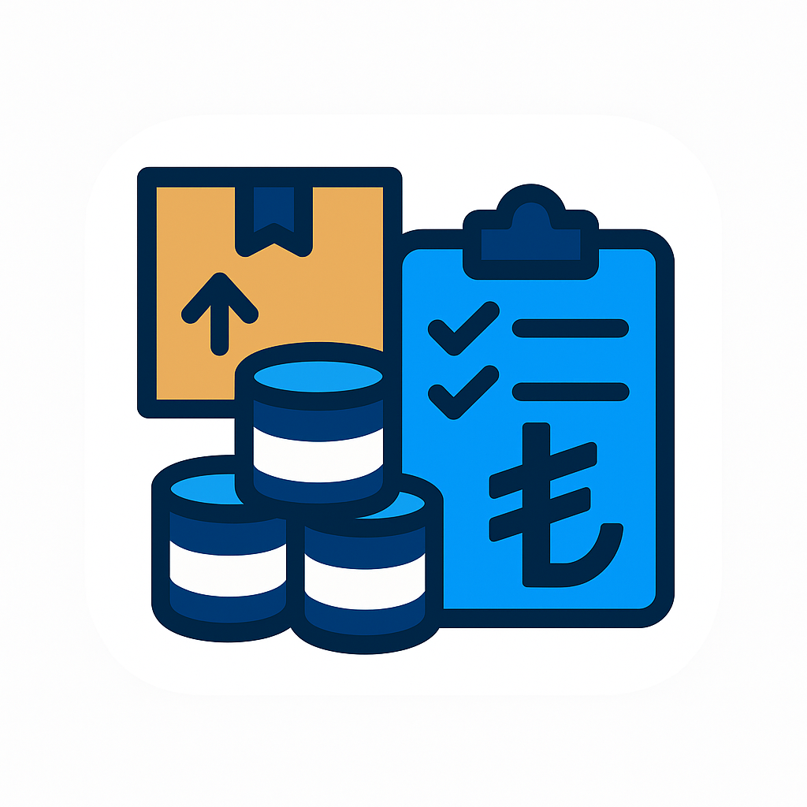

# 🏪 Malzemecim

### İşletmenizin Dijital Dönüşümü İçin Profesyonel Çözüm

**Nalbur, Hırdavat ve Boya Satış İşletmeleri İçin Kapsamlı Envanter & Veresiye Yönetim Sistemi**

---

## 🌟 Proje Hakkında

**Malzemecim**, işletmenizin envanter ve veresiye yönetimini dijitalleştiren, modern ve kullanıcı dostu bir işletme yönetim sistemidir. Flutter teknolojisi ile geliştirilmiş olan uygulama, Android, iOS, Web ve Windows platformlarında sorunsuz çalışarak işletmenizin tüm ihtiyaçlarını tek bir platformda birleştirir.

### 🎯 Misyonumuz

İşletmelerin stok takibinden veresiye yönetimine, barkod taramadan detaylı raporlamaya kadar tüm operasyonel ihtiyaçlarını karşılayarak, dijital dönüşümlerine katkıda bulunmak ve iş süreçlerini optimize etmek.

---

## ✨ Öne Çıkan Özellikler

### 📦 **Akıllı Ürün Yönetimi**

- **Kapsamlı Ürün Takibi**: Ürün ekleme, düzenleme, silme ve listeleme işlemleri
- **10+ Kategori Desteği**: Nalburiye, Boya, Elektrik, Tesisat, Hırdavat, Bahçe, İnşaat, Otomotiv ve daha fazlası
- **Çoklu Birim Sistemi**: Adet, KG, Litre, Metre, M², M³ ve özel birimler
- **Stok Yönetimi**: Mevcut stok ve minimum stok seviyesi takibi
- **Otomatik Uyarılar**: Düşük stok seviyelerinde anında bildirim
- **Görsel Yönetim**: Her ürün için en fazla 5 fotoğraf desteği
- **Barkod Entegrasyonu**: Ürünlere barkod atama ve takip sistemi

### 🔍 **Gelişmiş Barkod Tarama**

- **📱 Mobil Kamera Tarama**: Android ve iOS cihazlarda kamera ile hızlı barkod/QR kod tarama
- **🌐 Web Kamera Desteği**: Tarayıcı üzerinden kamera ile barkod tarama
- **💻 USB Barkod Okuyucu**: Profesyonel USB barkod cihazları ile tam entegrasyon
- **⌨️ Manuel Giriş**: Web platformunda esnek manuel barkod girişi
- **🎯 Çoklu Format**: EAN-13, EAN-8, Code 128, Code 39, QR Code ve 10+ format desteği
- **🚀 Otomatik Eşleştirme**: Tarama sonrası otomatik ürün bulma ve detay sayfasına yönlendirme
- **⚡ Anlık Algılama**: Sürekli tarama sorunlarını önleyen akıllı debounce sistemi

### 🔎 **Güçlü Arama Sistemi**

- **Çoklu Kriter Arama**: Ürün adı, marka, kategori, barkod ve açıklama üzerinden arama
- **Akıllı Algoritma**: Tam eşleşme öncelikli, kısmi eşleşme destekli arama
- **Barkod ile Hızlı Erişim**: Barkod numarası ile anında ürün bulma
- **Kategori Filtreleme**: Kategori bazlı hızlı filtreleme
- **Gerçek Zamanlı Sonuçlar**: Yazdıkça anlık arama sonuçları

### 💰 **Veresiye Yönetimi**

- **Müşteri Takibi**: Detaylı müşteri bilgileri ve iletişim yönetimi
- **Kayıt Yönetimi**: Aktif, ödenen ve vadesi geçen kayıtların ayrı takibi
- **Ödeme Sistemi**: Kısmi ve tam ödeme kayıtları
- **Vade Takibi**: Vade tarihi ve gecikme uyarıları
- **Ödeme Geçmişi**: Detaylı ödeme geçmişi görüntüleme ve raporlama

### 📊 **Kapsamlı Raporlama**

- **📉 Düşük Stok Raporu**: Minimum stok seviyesinin altındaki ürünleri anında görüntüleme
- **💵 Veresiye Özeti**: Toplam veresiye tutarı ve ödeme durumu takibi
- **🔥 Popüler Ürünler**: En çok aranan ürünler analizi ile satış stratejisi belirleme
- **📅 Aylık Özet**: Aylık satış ve stok özeti ile işletme performansını takip etme

### 📝 **Notlar ve Hatırlatıcılar**

- **Hızlı Notlar**: İşletme için anlık hatırlatma notları oluşturma
- **Not Yönetimi**: Not ekleme, düzenleme ve silme ile kolay organizasyon
- **Renkli Kategoriler**: Notları renklerle kategorize ederek hızlı erişim

### 🔐 **Güvenli Kimlik Doğrulama**

- **Email/Şifre ile Giriş**: Güvenli kimlik doğrulama sistemi
- **Kullanıcı Kaydı**: İşletme bilgileri ile kolay kayıt
- **Rol Tabanlı Erişim**: Admin ve Çalışan rolleri ile yetki yönetimi
- **Otomatik Oturum**: Kullanıcı durumu takibi ve otomatik giriş

---

## 🎨 Kullanıcı Arayüzü

### Modern ve Kullanıcı Dostu Tasarım

- **Material Design 3**: En güncel tasarım standartları
- **Responsive Layout**: Tüm ekran boyutlarına uyumlu tasarım
- **Akıcı Animasyonlar**: Kullanıcı deneyimini artıran geçiş animasyonları
- **Koyu/Açık Tema**: Göz yormayan renk paleti
- **Türkçe Arayüz**: Tam Türkçe dil desteği

### Platform Özellikleri

- **📱 Mobil**: Android ve iOS için optimize edilmiş mobil deneyim
- **🌐 Web**: Modern tarayıcılarda sorunsuz çalışan web uygulaması
- **💻 Masaüstü**: Windows için native masaüstü uygulaması

---

## 🚀 Hızlı Başlangıç

### İlk Kullanım

1. **Kayıt Olun**: Uygulamayı ilk açtığınızda kayıt ekranına yönlendirilirsiniz
   - İşletme adı
   - Ad Soyad
   - Email adresi
   - Güvenli şifre
   - İlk kayıt olan kullanıcı otomatik olarak **Admin** rolü alır

2. **Giriş Yapın**: Kayıt olduktan sonra email ve şifre ile giriş yapabilirsiniz

3. **Ürün Ekleyin**: İlk ürününüzü ekleyerek sistemi kullanmaya başlayın

### Temel İşlemler

#### 📦 Ürün Ekleme
- Ana ekranda **Ürünler** sekmesine gidin
- **+** butonuna tıklayın
- Ürün bilgilerini doldurun (barkod, fiyat, stok, vb.)
- Ürün fotoğrafları ekleyin (opsiyonel)
- Kaydedin

#### 🔍 Barkod Tarama
- **Tara** sekmesine gidin
- Kamera izni verin
- Barkod/QR kodu kameraya tutun
- Otomatik olarak ürün detay sayfasına yönlendirilirsiniz

#### 💰 Veresiye Ekleme
- **Veresiye** sekmesine gidin
- **+** butonuna tıklayın
- Müşteri bilgilerini ve tutarı girin
- Kaydedin

---

## 💡 Neden Malzemecim?

### ⏱️ **Zaman Tasarrufu**
Hızlı barkod tarama ve otomatik işlemler ile günlük işlerinizi hızlandırın. Manuel kayıt tutma ihtiyacını ortadan kaldırın.

### 📊 **Veri Odaklı Kararlar**
Detaylı raporlar ve analizler ile işletmenizin durumunu anlık görüntüleyin. Bilinçli kararlar alın.

### 💰 **Gelir Artışı**
Düşük stok uyarıları ile satış kaybını önleyin. Müşteri borçlarını takip ederek nakit akışınızı optimize edin.

### 🔒 **Güvenli Veri**
Bulut tabanlı güvenli veri saklama ile bilgileriniz her zaman güvende. Yedekleme ve senkronizasyon otomatik.

### 📱 **Her Yerden Erişim**
Mobil, tablet ve masaüstünde aynı deneyim. İşletmenizi nerede olursanız olun yönetin.

### 🎯 **Kolay Kullanım**
Sezgisel arayüz ve basit navigasyon ile kısa sürede öğrenin. Teknik bilgi gerektirmez.

---

## 🎭 Rol Bazlı Erişim

### 👑 Admin
- Tüm özelliklere tam erişim
- Ürün ekleme, düzenleme ve silme yetkisi
- Veresiye yönetimi ve takibi
- Kapsamlı rapor görüntüleme ve analiz
- Sistem yönetimi ve konfigürasyon

### 👤 Çalışan
- Ürün bilgilerini görüntüleme
- Barkod tarama ve ürün arama
- Müşteri hizmetleri için gerekli tüm araçlar
- Kişisel ayarlar ve profil yönetimi

---

## 🌐 Platform Desteği

| Platform | Durum | Özellikler |
|----------|-------|------------|
| 📱 **Android** | ✅ Tam Destek | Kamera tarama, USB barkod okuyucu, offline çalışma |
| 🍎 **iOS** | ✅ Tam Destek | Kamera tarama, offline çalışma |
| 🌐 **Web** | ✅ Tam Destek | Web kamera tarama, USB barkod okuyucu, responsive tasarım |
| 💻 **Windows** | ✅ Tam Destek | USB barkod okuyucu, masaüstü deneyimi |

---

## 📱 Ana Özellikler Özeti

| Özellik | Açıklama |
|---------|----------|
| 📦 **Ürün Yönetimi** | Kapsamlı ürün takibi ve stok yönetimi |
| 🔍 **Barkod Tarama** | Mobil, web ve USB cihaz desteği |
| 🔎 **Gelişmiş Arama** | Çoklu kriter ile akıllı arama |
| 💰 **Veresiye** | Müşteri borç takibi ve ödeme yönetimi |
| 📊 **Raporlar** | Detaylı analiz ve özet raporlar |
| 📝 **Notlar** | Hızlı notlar ve hatırlatıcılar |
| 🔐 **Güvenlik** | Rol tabanlı erişim kontrolü |
| 🌐 **Çoklu Platform** | Android, iOS, Web, Windows |

---

## 🛠 Teknoloji Stack

- **Framework**: Flutter 3.8+
- **Backend**: Firebase (Authentication, Firestore, Storage)
- **State Management**: Provider
- **UI**: Material Design 3
- **Barkod Tarama**: mobile_scanner
- **Görsel Yönetimi**: cached_network_image, image_picker

---

## 📸 Ekran Görüntüleri

> *Ekran görüntüleri yakında eklenecektir.*

---

## 🤝 Katkıda Bulunma

Bu proje özel bir projedir. Katkılar için lütfen iletişime geçin.

---

## 📄 Lisans

Bu proje özel bir projedir. Tüm hakları saklıdır.

---

## 👨‍💻 Geliştirici

**Mehmet Karataşlar**

- GitHub: [@mehmet-karataslar](https://github.com/mehmet-karataslar)
- Proje: [malzemecim](https://github.com/mehmet-karataslar/malzemecim)

---

## 🙏 Teşekkürler

- Flutter ekibine harika bir framework için
- Firebase ekibine backend altyapısı için
- Tüm açık kaynak kütüphane geliştiricilerine

---

### 🎉 Modern İşletme Yönetimi İçin Malzemecim ile Tanışın!

**İşletmenizin dijital dönüşümüne bugün başlayın.**

[⬆ Başa Dön](#-malzemecim)

